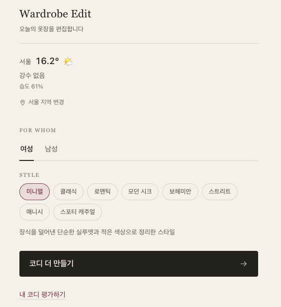
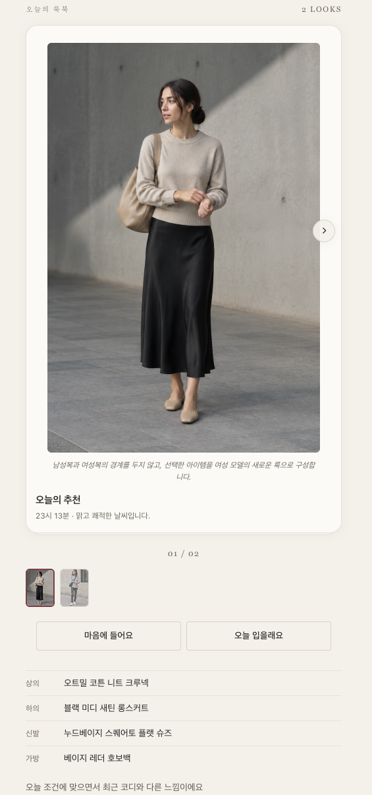
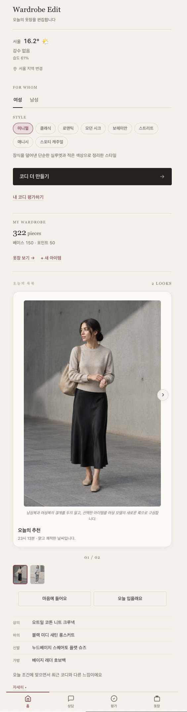
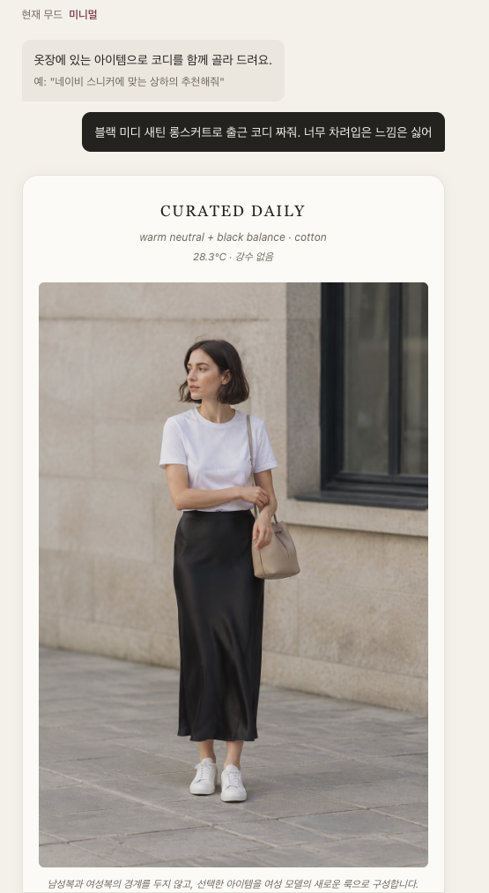
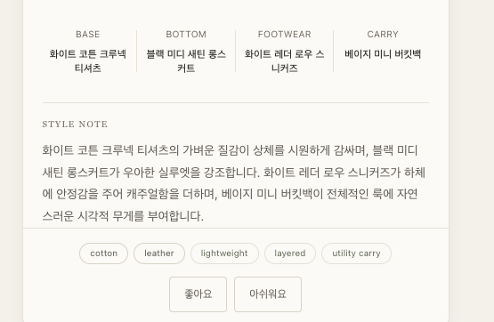
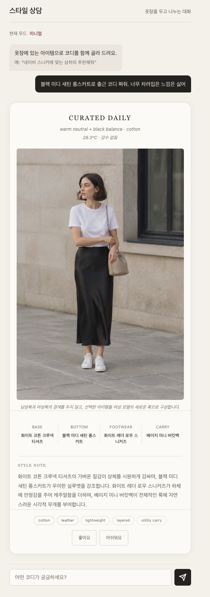

# Wardrobe Edit

> AI styling product with multi-model orchestration, evaluation pipeline and automated visual generation

추천 엔진 이름은 **Style Engine**입니다.

[](https://github.com/dasvador/style-engine/actions/workflows/ci.yml)

Wardrobe Edit은 사용자의 옷장과 그날의 상황을 바탕으로 코디를 제안하고, 각 선택의 이유를 설명하는 AI 스타일링 서비스입니다.

옷 사진을 등록하면 Vision 모델이 색감, 소재, 실루엣, 격식 등 스타일 정보를 정리합니다. 추천 단계에서는 날씨와 상황, 사용자의 스타일 선호, 최근 추천 이력을 함께 고려합니다. 결과는 점수만 제시하지 않고 조화로운 부분과 조정이 필요한 부분, 대체할 수 있는 아이템의 조건까지 보여줍니다.

> 이 프로젝트는 현재 개발 중인 개인 프로젝트입니다. 추천 결과는 스타일 선택을 돕기 위한 참고 정보이며, 사용자의 취향을 대신해 정답을 제시하는 것을 목표로 하지 않습니다.

## 화면

### 홈

날씨와 스타일 무드를 고르면 오늘의 코디를 추천하고, 그 착장을 룩북 이미지로 보여줍니다.

<table>
  <tr>
    <td align="center" valign="top" width="50%">
      <br>
      <sub>날씨와 스타일 무드를 고르고 추천을 받습니다</sub>
    </td>
    <td align="center" valign="top" width="50%">
      <br>
      <sub>추천 착장을 룩북 이미지와 아이템 구성으로 보여줍니다</sub>
    </td>
  </tr>
</table>

<details>
<summary>홈 화면 전체 보기</summary>
<br>
<p align="center">
  
</p>
</details>

### 스타일 상담

옷장에 있는 아이템을 하나 정해 물으면, 그 아이템을 중심으로 착장을 구성해 룩북 카드로 답합니다. 아래는 "블랙 미디 새틴 롱스커트로 출근 코디 짜줘. 너무 차려입은 느낌은 싫어" 에 대한 답입니다.

<table>
  <tr>
    <td align="center" valign="top" width="50%">
      <br>
      <sub>질문한 아이템을 중심으로 착장을 구성합니다</sub>
    </td>
    <td align="center" valign="top" width="50%">
      <br>
      <sub>구성 아이템과 조합 이유를 함께 보여줍니다</sub>
    </td>
  </tr>
</table>

<details>
<summary>상담 화면 전체 보기</summary>
<br>
<p align="center">
  
</p>
</details>

## 기술 요약

개인 프로젝트이지만, LLM을 쓰는 제품에서 반복되는 세 가지 문제를 실제로 다뤘습니다 — 모델을 용도별로 나누는 일, 추천 품질이 나빠졌는지 알아내는 일, 생성 비용을 통제하는 일.

### 모델 오케스트레이션

용도마다 요구가 다릅니다. 이미지 분석은 정확도가, 채팅은 응답 속도가, 룩북 이미지는 생성 품질이 중요합니다. 하나의 모델로 전부 처리하면 어딘가는 과하고 어딘가는 모자랍니다.

- **provider 2종**(OpenAI · Anthropic)을 공통 인터페이스 뒤에 두고, 요청 형식 차이는 각 구현체가 흡수합니다
- **태스크 11종**이 각각 모델과 파라미터를 따로 가집니다 — 코디 후보 생성, Vision 2단계, 코디 해설, 채팅 에이전트, 성별 검증, 이미지 생성, 임베딩 등
- 모델을 바꿀 때 코드가 아니라 설정만 고치면 됩니다

### 평가 파이프라인

추천 품질은 "좋아진 것 같다"로는 관리되지 않습니다. 규칙을 하나 고쳤을 때 다른 조건이 망가졌는지 알 방법이 필요합니다.

- 손으로 라벨링한 **고정 케이스 106건**으로 하드 필터와 적합도 판정을 측정합니다
- 결과를 스코어카드로 남기고 **baseline과 비교해 회귀하면 테스트가 실패**합니다 — 정확도 하락뿐 아니라 새로운 false positive 발생도 잡습니다
- 현재 하드 필터 정확도 95.3%, false positive 3건이 기준선입니다
- 이미지 분석의 **레퍼런스 검색**도 별도 케이스 68건으로 같은 방식의 회귀 검사를 합니다 — 맞는 레퍼런스가 2차 분석에 전달되는 비율 100%, 1순위로 찾는 비율 92.0%

### 이미지 생성과 비용

이미지는 이 제품에서 비용이 나가는 거의 유일한 지점입니다(실측 장당 $0.0123, 채팅은 턴당 $0.0023).

- 착장 구성과 프롬프트의 해시로 **캐시**를 걸어 같은 코디는 다시 만들지 않습니다
- 생성 후 **검증 단계**를 두고, 통과하지 못한 사실도 캐시에 남겨 같은 착장이 매번 재생성되지 않게 합니다
- 하루·한 달 **상한**과 생성당 비용 기록을 두어 지출을 추적합니다

### 그 밖의 구조

- **2-Pass RAG**: 1단계에서 옷의 외형을 서술하고, 임베딩 검색으로 찾은 레퍼런스를 참조해 2단계에서 정밀 분석합니다. 레퍼런스 41개는 사람이 검수한 것만 검색에 쓰고, 같은 의류 카테고리끼리만 비교합니다
- **타입으로 고정한 어휘**: 역할·톤·스타일·장르를 문자열이 아닌 enum으로 두어, 표준 밖의 값은 컴파일이나 행 디코딩에서 걸립니다 — 같은 버그를 두 번 낸 뒤 도입했습니다
- **마이그레이션 46개**: 파괴적 변경을 쓰지 않고, 데이터 백필은 재실행해도 결과가 같도록 작성했습니다
- 테스트 213개 (그중 4개는 `TEST_DATABASE_URL` 이 있을 때만 실제 DB 를 검사합니다)

## 주요 기능

- **디지털 옷장**: 옷 사진 분석, 스타일 속성 자동 정리, 직접 수정
- **상황별 코디 추천**: 출근, 데이트, 일상 등 상황과 날씨를 반영한 추천
- **스타일 장르**: 성별별 8개 대표 장르 중 선택한 장르에 맞는 아이템으로 추천 범위를 좁힘
- **코디 평가**: 색감, 균형, 활용도, 액세서리 조화를 기준으로 점수와 근거 제공
- **추천 이력 반영**: 최근에 반복된 아이템은 낮추고 새로운 조합에는 가산점 부여
- **대화형 스타일링**: 옷장 검색과 코디 평가 도구를 사용하는 AI 상담
- **룩북 이미지**: 선택된 코디를 착장 이미지로 생성하고 자동 검수

## 추천 방식

Wardrobe Edit은 LLM의 응답을 그대로 추천 결과로 사용하지 않습니다. 후보 생성과 평가, 최종 노출 순위를 서로 다른 단계로 나눴습니다.

```text
사용자 옷장
+ 날씨와 상황
+ 스타일 선호
+ 최근 추천 이력
        ↓
후보 아이템 선별
        ↓
LLM 코디 후보 생성
        ↓
규칙 기반 적합성 검사와 점수 계산
        ↓
최근 노출·다양성·당일 적합도 반영
        ↓
추천 결과와 선택 이유 제공
```

### 1. 후보 아이템 선별

옷장 전체를 모델에 전달하지 않고 상황, 기온, 아이템 역할, 최근 사용 여부를 기준으로 후보를 줄입니다. 입력 크기를 제한하면서도 필요한 카테고리가 고르게 포함되도록 구성했습니다.

### 2. 코디 후보 생성

LLM은 선별된 아이템 안에서 복수의 코디 후보를 구성합니다. 호출부는 특정 모델명이 아니라 `VisionPass1`, `Recommendation`, `StyleNote`와 같은 작업을 지정합니다. 실제 provider와 모델은 설정에서 교체할 수 있습니다.

### 3. 규칙 기반 평가

각 후보는 다음 네 가지 축으로 평가합니다.

| 평가 축 | 확인하는 내용 |
| --- | --- |
| Balance | 아이템의 역할과 시각적 무게가 균형을 이루는지 |
| Coherence | 색온도, 스타일, 소재가 자연스럽게 연결되는지 |
| Utility | 계절, 기온, 상황과 격식에 적합한지 |
| Accessory | 신발과 가방이 전체 조합을 보완하는지 |

명확한 충돌은 hard filter에서 제외하고, 통과한 후보에는 0~100 범위의 스타일 점수를 계산합니다.

### 4. 최종 순위 조정

기본 점수에 최근 추천 페널티와 다양성 보너스, 당일 날씨 적합도를 반영합니다. 같은 아이템과 비슷한 조합이 반복되는 현상을 줄이기 위한 단계입니다.

## 코디 평가 예시

```json
{
  "score": 74,
  "verdict": "Good",
  "summary": "전체적인 색감은 안정적이지만 출근 상황에 비해 신발이 다소 캐주얼합니다.",
  "strengths": [
    "상의와 하의의 색온도가 자연스럽게 연결됩니다."
  ],
  "problems": [
    {
      "code": "FormalitySituationMismatch",
      "deduction": 12,
      "detail": "현재 신발은 나머지 아이템보다 격식 수준이 낮습니다."
    }
  ],
  "suggestions": [
    {
      "type": "upgrade_formality",
      "recommended_colors": ["네이비", "차콜"],
      "recommended_examples": ["로퍼", "미니멀한 가죽 스니커즈"]
    }
  ]
}
```

점수, 판정, 문제와 제안은 규칙 엔진이 생성합니다. LLM은 이 구조화된 결과를 읽기 쉬운 설명으로 정리합니다. 설명 생성에 실패하더라도 평가 결과는 그대로 사용할 수 있습니다.

## 이미지 분석

등록한 옷은 두 단계로 분석합니다.

```text
이미지 업로드
    ↓
Vision 1차 분석: 눈에 보이는 특징 정리
    ↓
Embedding 검색: 유사한 의류 레퍼런스 탐색
    ↓
Vision 2차 분석: 레퍼런스와 함께 세부 속성 확인
    ↓
사용자 옷장에 저장
```

첫 분석에서는 확인되지 않은 브랜드나 모델명을 추측하지 않습니다. 레퍼런스는 첫 분석이 판단한 의류 카테고리 안에서만 찾고, 그 카테고리에 레퍼런스가 없거나 유사도가 충분하지 않으면 레퍼런스 없이 일반 분석 결과를 저장합니다. 자동으로 생성된 속성은 사용자가 직접 수정할 수 있습니다.

레퍼런스는 `data/clothing_references.toml` 에서 관리합니다. 각 항목은 형태·소재·식별 디테일과 함께 **혼동하기 쉬운 옷**과 **사진만으로 확정할 수 없는 것**을 적어 두어, 레퍼런스가 정답처럼 쓰이지 않게 합니다. 새로 쓴 레퍼런스는 사람이 검수해 승인하기 전까지 검색에 쓰이지 않습니다.

## 품질 검증

스타일 판단은 주관적일 수 있지만, 엔진 변경이 기존 결과를 예상치 못하게 훼손하는지는 반복해서 확인할 수 있어야 합니다.

- 106개의 라벨링된 평가 케이스 운영
- hard filter, 당일 적합도, 선호 조합 순위 지표 측정
- 기준선보다 결과가 나빠지면 CI 실패
- 규칙별 단위 테스트와 평가 스코어카드를 분리
- 새로운 랭킹 로직은 기존 결과와 함께 실행하는 shadow mode로 비교

현재 저장된 스코어카드:

| 지표 | 결과 |
| --- | ---: |
| Hard filter 정확도 | 95.3% |
| Today-fit 정확도 | 76.4% |
| 선호 조합 순위 정확도 | 75.1% |
| Hard filter와 Today-fit 동시 일치 | 73.6% |

레퍼런스 검색 스코어카드 (케이스 68건: 정답 있음 50, 정답 없음 18):

| 지표 | 결과 |
| --- | ---: |
| 정답이 1순위 (Recall@1) | 92.0% |
| 정답이 2차 분석에 전달되는 상위 5개 안 (Recall@5) | 100% |
| MRR | 0.957 |

이 수치는 실제 사용자 만족도가 아니라 저장된 평가 케이스에 대한 결과입니다. 평가 데이터의 범위와 라벨 품질에 따라 달라질 수 있습니다.

## LLM 연동

모든 모델 호출은 공통 client를 거칩니다.

```text
호출부: 작업 종류만 지정
        ↓
LlmClient
- 작업별 provider/model 선택
- timeout과 지수 백오프 재시도
- 응답 스키마 검증
- 토큰·지연시간·추정 비용 기록
        ↓
OpenAI / Anthropic provider
```

Chat, Embedding, Image 기능을 별도 interface로 구분했습니다. provider가 지원하지 않는 기능을 컴파일 시점과 설정 단계에서 명확히 구분하기 위한 구조입니다.

## 기술 구성

| 영역 | 기술 |
| --- | --- |
| Backend | Rust, Axum, Tokio |
| Frontend | React 18, TypeScript, Vite |
| Database | MySQL, sqlx |
| AI | OpenAI API, Anthropic API, Vision, Embedding, Image Generation |
| External data | 기상청 초단기실황 API, Open-Meteo fallback |
| Delivery | Docker, GitHub Actions |

운영 환경에서는 Axum이 API와 React SPA를 같은 origin에서 제공합니다. 프런트엔드와 백엔드는 코드로 분리하되 하나의 컨테이너로 배포할 수 있습니다.

```text
Browser
  ├─ /api/*      → Axum handlers → MySQL / external APIs
  ├─ /static/*   → uploaded and generated images
  └─ other paths → React SPA
```

## 주요 API

| Method | Path | Description |
| --- | --- | --- |
| POST | `/api/clothes/upload` | 이미지 분석 후 옷장에 등록 |
| GET | `/api/clothes` | 옷장 목록 조회 |
| POST | `/api/outfit/evaluate` | 선택한 코디 평가 |
| POST | `/api/recommendation/multi` | 복수 후보 생성·평가 후 추천 |
| POST | `/api/chat` | 도구 호출 기반 스타일링 대화 |
| POST | `/api/chat/image` | 착장 룩북 이미지 생성 |
| POST | `/api/feedback` | 선호·비선호 피드백 저장 |
| GET | `/api/style-moods` | 성별별 스타일 장르 목록 조회 |
| GET | `/api/weather` | 현재 날씨 조회 |
| GET | `/api/health` | 서비스 상태 확인 |

## 로컬 실행

### 요구사항

- Rust (`rust-toolchain.toml`에 버전 고정)
- Node.js 20 이상
- MySQL 8.0 이상
- OpenAI API key

### Backend

```bash
cp .env.example .env
mysql -u root -e "CREATE DATABASE rust_web_app"
cargo run
```

Backend는 기본적으로 `http://localhost:3003`에서 실행됩니다.

### Frontend

```bash
cd frontend
npm install
npm run dev
```

개발 서버는 `http://localhost:5173`에서 실행되며 `/api` 요청을 backend로 전달합니다.

### Production build

```bash
cd frontend && npm run build && cd ..
cargo build --release
./target/release/style-engine
```

### Docker

```bash
docker build -t style-engine .
docker run --rm -p 3003:3003 --env-file .env \
  -v "$PWD/static/images:/app/static/images" \
  style-engine
```

## 테스트

```bash
cargo fmt --check
cargo clippy --all-targets -- -D warnings
cargo test --all-targets
cargo test --test eval_scorecard -- --nocapture
cargo test --test retrieval_eval -- --nocapture

cd frontend
npm run build
npm run lint
```

GitHub Actions에서 format, lint, 전체 테스트와 두 스코어카드(추천 평가, 레퍼런스 검색)의 회귀 검사를 실행합니다. 레퍼런스 검색은 임베딩 API 를 부르지 않고 커밋된 벡터 스냅샷으로 재며, 레퍼런스 문장을 고치면 `python3 tools/retrieval-eval/embed.py` 로 스냅샷을 갱신해야 테스트가 통과합니다.

## License

[MIT](LICENSE)
